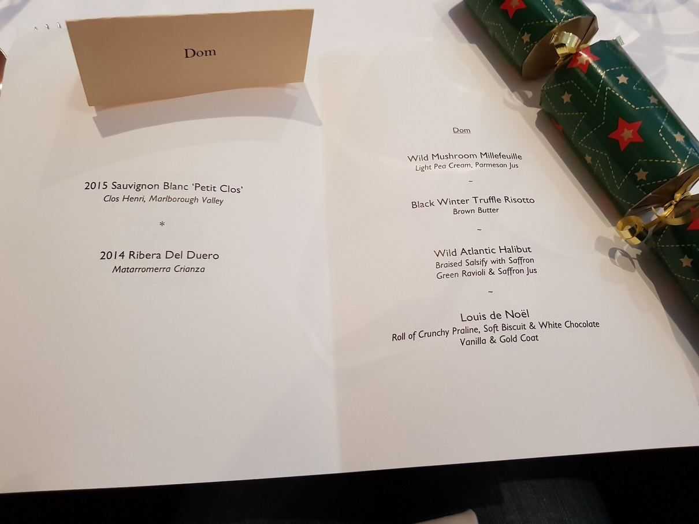

One Christmas tradition that Spark is always _very_ keen to keep is the office Christmas party. Having worked at a number of places over the decades, I’m well aware that an office Christmas party doesn’t equal automatic joy and happiness for everyone involved. In an ideal world, it would look like the end of _It’s a Wonderful Life_. However, without a bit of thought it could end up like the end of an _EastEnders_ special.

Obviously we want the former – which means making sure the Christmas party has something for everyone. At the end of a busy year, we feel the most important thing is to be able to relax and celebrate a job well done. This is what the party aims for – a nice lunch, a gentle bit of partying at the office, and then as much pub and/or office karaoke as people feel comfortable with afterwards.

2017 has been a great year for Spark, and this year’s lunch was booked at [Gauthier Soho](http://www.gauthiersoho.co.uk/) – which “offers assorted menus of … classically based cooking, with vegetarians particularly well looked after” according to the Michelin guide. With the Spark team up to a rousing 22, it would be deeply unfair on the rest of the restaurant for us to all cram into the main dining room. So a private upstairs room it was – tastefully decorated and all. Given the scale of the undertaking for the restaurant, we’d chosen our courses in advance – which meant the personalised menus saying exactly what you ordered were a welcome reminder to those of us who’d forgot.

I’m no budding Jay Rayner but the food was perfectly delicious – black winter truffle risotto with just the right bite of woody bitterness; a wild mushroom millefeuille that snapped under the fork like a block of ice that’s been chopped in the _Karate Kid II_; wild Atlantic halibut that tasted of childhood holidays in Sandbanks; and little cheesy wafer things that were really cheesy. Plus Christmas crackers – incidentally, if anyone at Spark has my little jumpy frog thing, can they let me know?

Then back to the office for gifts for a hard year’s work, Secret Santa (strict spending limits and to be honest, if you’re not sure what to get someone, the “secretness” can be quite loosely interpreted) and carols around the tree. Or at least karaoke around YouTube on the telly in the more soundproof meeting room – this year with an actual microphone and amp instead of shouting into a beer bottle. I still don’t know who got me the John Lewis voucher, but it was the absolutely perfect gift, so thank you mystery benefactor. 

Finally, it was time to wrap the evening up at the Dog & Duck, with people chatting, nattering, chin-wagging, and guarding our small group of reserved tables like our lives depended on it. At this point, people slipped away as and when they felt, winding their way home or, in the case of the VERY remote workers, to the Euston Travel Lodge. So what did we learn from it all? Well:

-	A Japanese New Year shirt is NOT the same thing as a Christmas jumper, and people should stop pretending it is
-	Mauritian honey rum is very nice, especially with lemonade
-	Just because a dessert is red, doesn’t mean it’s got cherries in
-	Christmas parties are even christmassier when it snows its guts out the weekend after
-	Mutual hugging and deciding you really love and respect each other increases by at least 50% after 10pm
-	The final _It’s a Wonderful Life_/_EastEnders_ ratio was a solid 10/0
