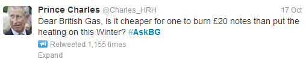
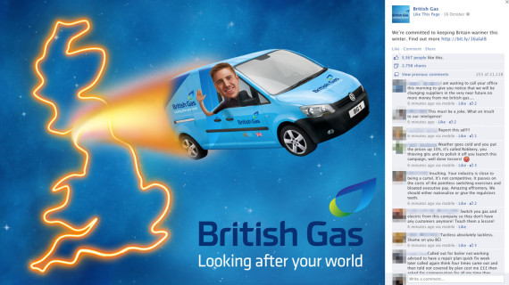

Energy firms are seldom in the news for good reason, receiving regular berating from the public. Good PR for them is hard to come by. Recently, British Gas [announced](http://www.bbc.co.uk/news/business-24562930) an eye watering 9.2% price increase, just in time for winter, and caught headlines once again. But, it also announced a [live Twitter chat](https://twitter.com/BritishGas/status/390809239792254976) with Bert Pijls; the company’s customer services director the very same day, providing the ingredients for the perfect storm.

{.img-left}

The results were calamitous. Thousands flocked to Twitter to vent their frustrations sending [#askBG](https://twitter.com/search?q=%23AskBG&src=tyah) to the top of the UK trends; the torrent of abuse there for all to see in a nice, easily searchable form. Tweets ranged from accusative, to angry and to downright comedic – but whichever way you look at it, the backlash was relentless. To make matters worse, the few responses from Bert were unhelpful at best, providing very little information which only exacerbated the situation. British Gas walked away with its tail between its legs.

{.img-left}

To make matters worse, only days later the company posted a sponsored post on Facebook for all to see:

{.img-left}

The result? Over 20,000 negative comments, thousands of shares. With two public forums for angry users to vent their frustrations, the effect was catastrophically negative PR for the company and [disaster](http://gs7.globalsuccessor.com/centrica02/tpl_centrica02.asp?s=4A515F4E5A565B1A&jobid=36882,8958347134) for one poor social media manager.

[Commentators have cited #AskBG as one of the most extreme social media disasters](http://www.theguardian.com/money/2013/oct/17/british-gas-backlash-price-hike-energy-bills), but why did this happen in the first place? It’s hard to imagine that the social media team thought this would be a good idea – they were inevitably walking head first into a lose-lose situation. It seems to point at a lack of preparation and a lack of connectedness throughout the company. Was the social media team aware of the upcoming price hike? If not, then why were they not communicating with the rest of the company? And if they did know about it, then why did they seem so ill-prepared for the backlash and why did they allow this to happen twice?

British Gas was always going to receive negative press for its price hike, but placing its customer services director at the centre of it did it no favours. It’s only scratching the surface of a complex topic, but with proper preparation, British Gas could have managed the crisis much more elegantly. It could have provided useful information to customers and avoided the second disaster on Facebook.

But whatever the case, the lessons to be learnt are to put careful consideration into social media strategy, especially one that is so scrutinised by its customers. And when customers have a public forum to engage with you, every outcome needs to be prepared for. All parts of the company need to be properly communicating with each other ahead of time to understand its audience, and have suitable responses prepared. And most of all, social media activity needs to be aligned with business activity; communications is a part of the business, not a separate entity in itself. They need to remember to work as such.
