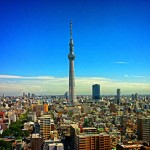
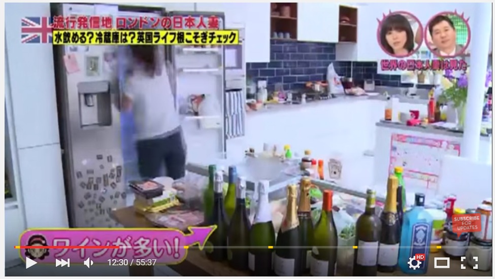

**{.img-left}**This year saw the greatest event in entertainment media history since the Independence Day teaser trailer campaign. [TBS in Japan](http://www.mbs.jp/japa-zuma/) saw fit to broadcast an hour-long special on the UK, featuring a substantial contribution by yours truly. I won’t dwell on the actual content of the programme, although for anyone who has [watched it](http://video.fc2.com/content/20150901kDBPdWyE) I’d like to point out that I did **not** dress like that when I proposed, and the thing with the rice is pure fantasy. That is a pretty representative sample of our fridge’s everyday contents, though.

{.img-left}

What is relevant is just how much effort and time goes into creating 45 minutes’ worth of television, and just how much falls by the wayside. I’ve read before about how 90% of film-making is boredom, but experiencing it in the flesh is another thing entirely. Two days’ worth of filming in London and leafy Buckinghamshire, coupled with another two days in Japan, turned into just one segment in the whole programme. Entire segments were dropped completely, which was especially galling considering I put myself through eating deep-fried Mars bars for nothing. And ultimately what looked to be an unwieldy sprawl of interviews, reconstructions, travelogue and lots of film of cooking turned into a single, tight episode.

In this way, the business of PR is a lot like TV production; especially the editing process. The average client will produce a huge amount of content and ideas that will be more or less useful and interesting for the audience, whether speaking to them directly via content marketing activities or via the intermediary of the media. Our job is to act as editors, sorting through all of this material to identify which will be both of most interest to the audience and of greatest benefit to the client. This judgement is crucial; after all, simply flinging everything out will both be a hugely inefficient use of PR’s time and quickly lead to fatigue from the press and a disengaged audience. Similarly, what’s of interest to the audience and the client won’t always line up. Most publications will be less than fascinated by award wins, particularly those from a rival publication; while not every client story is one they want to see plastered across Twitter and beyond. Taking everything available, judging what is most valuable, and forging a narrative that allows us to tell the client’s story to the right audience is where we really demonstrate our value. Do it right, and clients are presenting precisely the right face to the world. Do it wrong, and people will be asking where and why they spent their money.

Now, if you’ll excuse me, my public awaits. I actually got recognised in the supermarket the other day.
