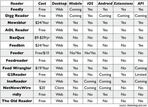

Since the demise of Google Reader  114,755 people have laid a flower in [Slate’s Google Graveyard](http://www.slate.com/articles/technology/map_of_the_week/2013/03/google_reader_joins_graveyard_of_dead_google_products.html) for it.  While there was some very vocal outrage at the initial announcement, with a petition to save the service reaching just over 100,000, it was never going to happen.

In reality I think the news can be best been summed up by Will Dean from the Independent “RIP Google Reader, ignored by many, loved by few.” However, as outlined in [Alex’s earlier post](http://www.sparkcomms.co.uk/index.php/2013/04/rip-google-reader/) RSS feeds are still a vital tool for anyone in the technology PR industry, enabling us to keep on top of the news agenda for those all important issues response opportunities, without having to sift through other people’s comments or tweets. So the question is where to now for PR's and journalists who need their RSS feeds?

So far, Digg Reader, Feedly and AOL Reader seems to be leading the charge. For more of an idea of what is out there, [MarketingLand](http://marketingland.com/) has created this very handy table that provides a quick outline of what alternatives are on offer:

In order to work out which reader would be best I decided to sign up for Digg Reader, Feedly and AOL Reader. The whole process for Digg and Feedly couldn’t have been easier! Within minutes all my feeds were loaded into the new reader and all I literally had to do was click one button. My initial reaction is there isn’t a lot of atheistic difference between the two and the old Google Reader. Which I believe is the general aim and the best option for those who merely want their RSS feeds presented in a logical and familiar format.  AOL took fractionally longer and I then received the message that they had reached capacity and that I was on a waiting list. So that automatically cut them from my list.

However, if you are looking to do something more with your RSS feeds, the most helpful way of deciding which solution would best suit your requirements is a [flow chart](http://www.slate.com/articles/technology/technology/2013/06/digg_reader_aol_reader_feedly_which_google_reader_alternative_should_i_use.html) created by Chris Kirk at Slate.  The chart combines effort factor (how lazy are you?) with platform, design, integration with social networks and cost.

In short, the demise of Google Reader is no bad thing as it looks like re-igniting interest in how people consume their online news.
