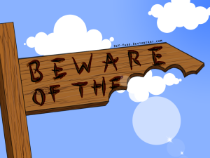

Political party conference season can really spook a company spokesperson, even the most experienced will recoil in horror at the thought of a grilling from Nick Robinson.   Conference season may be over but the impact remains on anyone that has to face the press.  But with Halloween approaching maybe it is time to [feel the fear and do it anyway.](http://www.susanjeffers.com/home/detailtemplate.cfm?catID=2234)

Fear rather than a ‘scary’ journalist is the most common reason for missed opportunities.  Most IT journalists aren’t looking for a points scoring battle with the spokesperson, they are more typically on a deadline and need a good quote to support the angle they want their article to take. 

In fact, it is more common to trip yourself up.  Spokesperson stage fright can mean that the discussion before the interview is forgotten or ignored.  A reminder to ‘treat questions as an opportunity’ is often dismissed with; ‘you have to be joking; I’m just trying to get through the interview and hoping for one decent quote.’ 

But often journalists are the opposite of their reputation as belligerent and difficult. Sometimes the journalist will even spoon-feed the quote to the spokesperson e.g. “so would you say that we should expect a shake-up in the industry?”  Or “do you think this represents a change in the way that companies will operate?”  However, if the spokesperson has gone into the interview perceiving it to be a battle rather than a collaboration s/he may miss this golden opportunity. 

There are three things you need to remember when responding to questions.  The first is that the journalist will often deliver you the opportunity on a plate.  If the question is something that they want to quote you on then remember to paraphrase it as part of your quote.

The second is that you can influence the direction of the interview by answering questions in the right way.   If it is a difficult question or it misses the point you can shift the focus.  Your PR agency can teach you how to do this in advance.  There is no rush, demonstrate why you think it is more important to answer a different question and then deliver a killer quote. 

The third is that you should always answer the question unless there are exceptional circumstances.   Otherwise Jekyll could become Hyde (which takes us back to [Nick Robinson](https://www.youtube.com/watch?v=yTXYlJNZ7tU) again). [This](http://www.computing.co.uk/ctg/news/2376908/bmc-software-compuware-and-now-tibco-why-are-more-and-more-software-companies-being-taken-over-by-private-equity) is a good example of where our spokesperson for Compuware really excelled at delivering the quotes the journalist wanted.    

Tech PRs also need to remember that our job doesn’t start or end with securing the interview.  Prior to calling the journalist we will have worked with the spokesperson to come up with some interesting ideas and we are as much to blame as the spokesperson if s/he doesn’t deliver what we’ve offered.  So in addition to reminding the spokesperson to spot the opportune questions as well as being on their guard for the tricky ones, we need to provide as much detail as we can on the planned piece beforehand. 

During the interview we must be ready to prompt the spokesperson so that the journalist gets what’s required for the piece. Once the interview is complete journalists will expect a follow-up call from us to check that we’ve delivered what we promised when we set up the interview and to provide supporting materials to complete the story. 

Finally, continuing on the Halloween theme, remember that no-one likes a zombie so relax and be effusive.  And if the interview is a frightening experience then blame us!

_(Image: [deviantART](http://rey-yaro.deviantart.com/art/Beware-of-the-180587693))_
