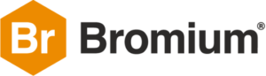

We are seeing a bit of a trend at the moment where more and more US companies are asking us, rather than a US agency, to lead their PR efforts globally.  That’s exactly what has happened with [Bromium](http://www.bromium.com), who we’ve just added to our list of security clients. It’s a six-figure brief to look after UK PR and develop storylines and campaigns globally.

The security market is red hot at the moment and Bromium is right at the heart of it. The founders have a proven track record having created Xen, the technology that was sold to Citrix for half a billion dollars and that today underpins the world’s leading cloud infrastructures, including Amazon’s cloud services. Bromium’s platform is one of the most unique technologies I’ve seen. It uses something called micro-virtualisation to isolate every task a user ever undertakes on a computer – it means that you don’t have to worry about your PC getting infected by malware from a website or email attachment, nor do you need to worry about ransomware. It’s pretty cool and dare I say disruptive :).

From a comms perspective Bromium is a dream. From day one the team made it clear that they wanted us to lead their PR efforts and utilise the content we develop across the marketing mix. We pitched some pretty creative and even slightly controversial storyline that they are up for driving forward.

Here is what Jennifer Carole, VP of marketing at Bromium had to say:

“There are PR firms and then there is Spark. As soon I landed at Bromium my leadership team and I wanted to bring them on board. It might seem strange for a US software company to have its PR led out of London, but ultimately they think strategically and globally. We are at an exciting juncture – our technology has matured to a point where we can change the dynamics of security forever. But technology alone won’t make us successful, we need clear and powerful communication and that’s what we get from Spark. The team has a unique mix of skills, give clear advice and ultimately I know they will make a difference to our business.”

The team has already started getting some great results – check out this piece on the [BBC](http://www.bbc.co.uk/news/business-38829663).
