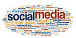

{.img-left}The short answer is probably [no.](http://blog.hubspot.com/marketing/anti-social-ceo-hurting-brand-data?utm_campaign=blog-rss-emails&utm_source=hs_email&utm_medium=email&utm_content=12671470&_hsenc=p2ANqtz-_FS7VjjxfrPbEyOu2pxwUh2zZdOX6lJHGc8mq3brtshhRER2ps_dkBNdEfZJVtC87s0isfXwqoEa5ZdhfX349YB51TnA&_hsmi=12671470)  Theories abound as to [why](http://blog.hubspot.com/marketing/ceos-you-cant-afford-to-ignore-social-media-anymore?utm_campaign=blog-rss-emails&utm_source=hs_email&utm_medium=email&utm_content=12601718&_hsenc=p2ANqtz-9KlzcyE8eUHqeWvQgcVb4N64UOwHO6yPzljvfEZRCGrtWOY7DNNFZ54o4aPap4TFzlEnieBiGNfH0naUoMYPEmQnzXgw&_hsmi=12601718) CEOs aren’t participating and if I had to pick a front-runner I’d say it’s the perception of ROI.  LinkedIn [disagree](http://www.independent.co.uk/news/media/opinion/ian-burrell-people-take-what-they-read-on-linkedin-very-seriously-9212497.html) and believe that if you use the platform in the right way you will engage with the right people.  Evidence from LinkedIn [authors](https://www.linkedin.com/today/post/article/20140514122644-143109-how-a-single-linkedin-blog-post-took-5-days-to-outperform-my-entire-blogging-output-over-the-previous-4-years-and-what-we-can-learn-from-this?trk=prof-post) backs this up and there are some prominent CEOs that are extremely visible on LinkedIn such as [Richard Branson](https://www.linkedin.com/in/rbranson) - often [heralded](http://www.forbes.com/sites/carminegallo/2012/10/22/richard-branson-if-it-cant-fit-on-the-back-of-an-envelope-its-rubbish-interview/) as the gold standard for CEO communications.

Social media enables CEOs to communicate company values to their customers and more importantly find out what they really think.  A Brandfog CEO [survey](http://www.brandfog.com/CEOSocialMediaSurvey/BRANDfog_2014_CEO_Survey.pdf) found over 2/3 of US and UK respondents agree that social media has become an essential aspect of PR and communications strategy for C-Suite executives.  We know that CEOs are not short on good content as it is pretty difficult to get to the top of the corporate tree without a vision, so why not share it to help the business?

If finding the time is the problem, then the public relations team must help them to maximise activity but minimise the time getting involved takes.  PR agencies are pretty used to badgering CEOs to talk– and if we can set up conversations with the right people a CEO will readily find time.  However, when it comes to social media, we can’t pile on the pressure in the same way as there is no journalist deadline.  

Or maybe it is less about time and ROI and more that the idea of putting an opinion out there without a communications team to filter it seems too risky? Two-thirds of [The Economist's](http://www.economistinsights.com/business-strategy/opinion/ceos-face-axe-embarrassing-opinions?elq=d38e8105b7fc40a7878670b4660ad6f7&elqCampaignId=1781) opinion leaders panel believes that senior executives should be fired for potentially damaging personal views.   However, the risk of brand damage is minimal unless the CEO’s views are particularly unsavoury and shouldn’t be allowed in public. 

There are some skills that need to be learnt.  Grandiose language used in marketing materials won’t work (I am thinking of the ['innovative'](http://www.sparkcomms.co.uk/2014/04/29/innovation-belong-toilet-paper-pr/) toilet paper company).  Journalists and PRs edit out bombastic, self-promoting, salesy comments, but on social media CEOs need to edit themselves.  What gets quoted by journalists is also what will be ‘liked’ and shared on social media so apply the same rules.

If you are a CEO reading this - or work for one - and are convinced of the value of social media there are a number of things you should think about.  As it is unlikely you are Richard Branson or work for Richard Branson, then social media won’t work in quite the same way for you:

o   People need to know a bit more about you than just the fact that you don’t like [ties](https://www.linkedin.com/in/rbranson).  What’s your story/personal brand?

o   Don’t view social media as a failure if you don’t have in excess of 4.5 million followers

o   Think about what people want to talk about and engage them.  PR agencies are good at helping with this as we are either [creating stories](http://www.telegraph.co.uk/technology/news/10830120/FIFA-scores-an-own-goal-with-buggy-mobile-app.html) to pitch stories to the media or relating our clients to stories that the media are writing [about](http://www.theguardian.com/small-business-network/o2-partner-zone/flexible-working-smes-growth) 

o   Find out where the worthwhile conversations are happening – it is quicker than waiting for people to come to you

o   If you find something interesting then other people in your industry will want to know about it too.  Share insights from other experts

o   If you are posting information about your company make sure you link it back to the topics that people are interested in.  Your latest product announcement is unlikely to get in the ‘trending’ list, unlike say the first passenger spaceflight

o   Finally, check your buzzwords - are any of them on the [‘Don'ts’](http://www.ragan.com/Main/Articles/48270.aspx) list for LinkedIn?  

Time to review my LinkedIn profile to confirm that I create and increase rather than innovate and strategise! 

_(Image: By Sofiaperesoa (Own work) [CC-BY-SA-3.0 (http://creativecommons.org/licenses/by-sa/3.0)], via Wikimedia Commons)_
