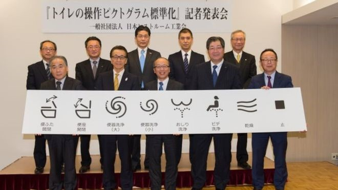

**Clearing The Air: Why Japan Is Lifting The Lid On Simpler Language**

In PR, we’re (ideally) taught early on that clarity is everything. In that light, the [announcement](https://www3.nhk.or.jp/nhkworld/en/news/20170117_37/) by Japanese toilet seat manufacturers that they’re standardising control icon, which has been seen in some quarters as an amusing “and finally…” section to the news, takes on a new significance. With the Asian Games, Rugby World Cup and Olympics in quick succession, Japan needs to be prepared for a vast influx of visitors; most of whom will be utterly unfamiliar with the delights of using a toilet with more controls than just a flush. In these circumstances, making using a Roboplop as simple, understandable and universal an experience as possible has clear benefits to the nation, and more importantly to uncomfortable confused visitors.

Of course, this isn’t anything new: it’s not like anyone wanting to play, pause or record a tape, video, DVD or Netflix stream doesn’t know exactly what symbol means what. Standardisation and simplification are critical for increasing understanding, reducing confusion and, in many cases, ensuring safety; all of which hold true in PR. All too frequently, people want to seem clever; often too clever. I’ll hold my hands up to being guilty of this myself, searching for a new way to describe a client’s or our own product or service when there’s a perfectly acceptable, and understandable, term just sitting there. Differentiation is important, especially with so much potential exposure ruled by the whims of Google’s search algorithms. Yet there’s a difference between differentiation and obscurity.

Instead, we need to pick our battles. After all, if I tell people I work in b2b tech PR, they get it (more or less). Suddenly I decide to tell people I’m a “thought leadership clavicle” or another term of my own creation, and I shouldn’t be surprised if I’m met with blank stares. Instead, I can differentiate myself through what I do; how I do it; and who I do it with (and for). Similarly, there are times you do need a completely new term to describe what you do. However, the easier you can make it for your audience to understand, the more they’ll thank you. So ideally base it upon existing, well-understood terms, and have an easy-to-parse explanation waiting in the wings.

Much like the Japanese toilet seat industry, we need to know where we should focus our creativity, and where we should instead concentrate on being as simple and straightforward as possible. This isn’t always the easy option; it no doubt took time and effort to come up with symbols that would allow 7 billion people to have a really good idea of what’s about to happen beneath them. However, the more time and effort we put into keeping things simple, the larger the audience we can reach, and the more we can trust that we’re taking that audience with us.

NEW INSTRUCTIONS: From left – Mrs. Pac-Man; Pac-Man; sonic boom; hadoken; ants at a picnic; ejector seat; beach holiday; privacy window. (Picture credit: JAPAN SANITARY EQUIPMENT INDUSTRY ASSOCIATION)

