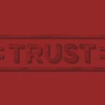

I recently read an article by Ian Burrell bemoaning the prospects of the journalism industry, arguing that it’s slowly being killed off by PR itself – he’s by far the first to make this claim. Referring to the ‘churnalism’ of Nick Davies’ infamous _[Flat Earth News](http://www.flatearthnews.net/)_, Burrell argues that the tempestuous love/hate affair between journalism and PR is only getting worse as large corporate organisations are now bypassing journalism altogether, and going direct to their ‘publics’ with a vast array of homemade content delivered straight to the customer themselves. And in doing so, he asks the question, does PR still need traditional press?

In a word, yes.

Burrell uses the examples of large, cash-rich organisations like Mishcon de Reya as prime suspects in this journalism-circumventing trickery, and whilst Mishcon are creating a huge amount of (actually very innovative) content, this kind of activity is far from the norm for the majority of PR campaigns. It’s a cold, hard fact that few clients of [PR agencies](http://iworkinpr.tumblr.com/) have hundreds of thousands to spend on creating flashy video and [native advertising](http://www.marketingmagazine.co.uk/article/1225609/will-native-advertising-big-marketing-story-2014), what they really want is the most bang for their buck. And that buck, literally stops somewhere; funds are tightly managed and budgets may often be limited. This means that PR must not only be creative, but maximise every possible opportunity for influential editorial (un-paid) coverage – and doing that means you have to know what journalism and journalists want.

Way back when, one of my excellent university tutors advised us all to read _Flat Earth News_ before any other of the weighty tomes recommended for the course. He was adamant in telling us green, keen PR kids that we should steer as far from this kind of PR as we possibly could if we wanted to be trusted consultants to clients and forge strong relationships with the press. He was of course right and his words have stuck with me. And while I can’t argue away that there’s a lot of [bad PR](http://whitelabelglobal.com/blog/item/you-know-what-i-dont-want-to-be-your-clients-kibble) out there, by the same token, there’s a lot of [bad journalism](https://twitter.com/badjournalism) too.

When all is said and done, PR and journalism still need each other; even if more content is being created by companies and PR agencies themselves. Content still needs disseminating, and the best way of doing that is through trusted and [influential media](http://en.wikipedia.org/wiki/Print_media). Hard-won editorial coverage in a national paper or key trade publication trumps native advertising on Buzzfeed any day of the week. I think Ian Burrell is actually somewhat undervaluing ‘traditional press’. To many people, both clients and consumers, it still has a huge amount of influence and value and remains a key factor in PR activity. Don’t worry too much just yet, Ian. We may not always get on, but we don’t want to see you going anywhere.

_(Image: [Artem Popov](http://www.flickr.com/photos/7259240@N03/5531511558/in/photolist-9qNrEW-fuknWp-boDhQG-ehZgeQ-hq3UqD-9iYp3u-dcMDTR-ccYbSJ-a5qczQ-dgZisb-8hyCoh-eNViE8-cyDhLw-98T7cM-8Bc69k-gxqjeC-fMJB3r-bcxmGP-edBueJ-edvX7V-edBGJf-b1Vagp-7WN6tK-8vQ178-ahd82P-84QYLQ-7TDarY-afYQ3A-dRfEUy-8mZsxY-7zsvmi-7Fh8oC-9dfG9B-anEbpm-8DnUGt-9pHgZT-aJdWkX-aHaxea-eg4CpB-7U1y16-esuzMW-hGDUzc-7DE9BD-7GJMLG-9WqN7V-fda1R7-8R4RcD-9F71zo-faTPDq-bVd5Hq-9YHXbg/) via Flickr Creative Commons)_
