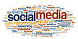

Ours is the first generation that had an official announcement on the birth of a future King of England, Prince George of Cambridge, from an [account on Twitter](https://twitter.com/ClarenceHouse).  While I am no flag-waving royalist this does say something about the ubiquity of social media as a news source. The internet, mobile and social media now mean that news is rapidly becoming a user-driven phenomenon, with social media in particular leading the charge. This is particularly evident in our personal use of social media: a recent survey from MyLife.com showed 56% of people are afraid of missing out on events, news and important status updates if they are away from social networks, as displayed in this [colourful infographic](http://mashable.com/2013/07/09/fear-of-missing-out/?utm_campaign=Feed%3A+Mashable%2FSocialMedia+%28Mashable+%C2%BB+Social+Media%29&utm_cid=Mash-Product-RSS-Pheedo-SocialMedia-Partial&utm_medium=feed&utm_source=feedburner).

The importance of social media goes over and above finding out which of your friends-of-friends are “single” or “in a relationship”; it can also have great benefits to the world of current affairs and spreading information on important world events, as outlined in a great [TED Talk by author Clay Sharkey](http://www.ted.com/talks/view/lang/en/id/575). User-generated news means that everyone with internet connectivity can become a reporter on current events, and so we are able to know about world events from people _in situ _as they happen and without the filter of censorship. The downside of this is that reporting via social media does not require journalistic rigour – i.e. backing up claims with (that old chestnut) PROOF! One silver-haired, former Gopher-aficionado (who shall of course remain unnamed) [would have done well to bear this in mind recently.](http://www.independent.co.uk/news/media/tv-radio/itv-pays-out-125000-to-lord-mcalpine-over-this-morning-paedophile-list-fiasco-8343778.html)

In PR this means a couple of things – the most obvious is [be careful what you do on social media](http://mashable.com/2012/11/25/social-media-business-disasters-2012/). The next wider point is that the rise in social media is due in part to demand for information being at an all-time high. According to a book by Rick Smolan, _The Human Face of Big Data_, the amount of information that [an average person is exposed to in a day is the same as a person from the 15th century was exposed to in his lifetime](http://www.fastcocreate.com/1681986/earth-s-nervous-system-looking-at-humanity-through-big-data#1). The point for PRs is that we need to be adding value to any news we put out rather than just adding to the pile of useless information. The time that each person has to read through every story is becoming ever more limited; we increasingly need to make sure the key message of our content is retained after being put through the meat grinder of digital media. The way we consume news is changing but delivering clear, concise messaging that benefits the reader will always have its place.

_(Image: By Sofiaperesoa (Own work) [CC-BY-SA-3.0 (http://creativecommons.org/licenses/by-sa/3.0)], via Wikimedia Commons)_
