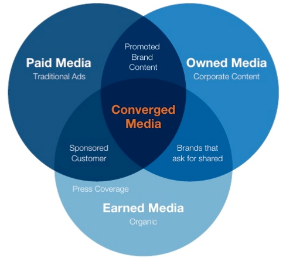

In the pre-content marketing age, our experience of paid media in b2b tech PR was largely a ‘colour separation’ fee which meant your press release would be published.  Now, the lines between advertising, PR and marketing are dissolving rapidly.  The Venn Diagram may eventually become a blob under the content marketing umbrella.  Joe Pulizzi from the Content Marketing Institute even [predicts](http://contentmarketinginstitute.com/2017/12/content-marketing-predictions-2018/)  that this year two Fortune 500 companies will hire a content expert (a publisher or a media exec) as their CMO.  

That’s why being voted number one for content in a [PR Week journalist survey](http://www.sparkcomms.co.uk/create-engage-and-influence)  is so important to us - a successful PESO (paid, earned, social, owned) is dependent on good ideas.  The story is the starting point but once you’ve got an idea, how do you decide whether to go paid, owned or earned?  Using all three in tandem increases the impact of all of them so you are unlikely to come to the conclusion to only pick one, but budgets only stretch so far so decisions need to be made on how, why and when should you use each.   Altimeter Group’s Venn diagram (below) captures the overlap perfectly and is a useful way of analysing what you currently do and what you want to do.

_Image credit: [Altimeter Group](https://www.slideshare.net/Altimeter/the-converged-media-imperative)
_

[Forrester's](https://go.forrester.com/blogs/09-12-16-defining_earned_owned_and_paid_media/) report provides some thorough definitions and a great overview of the advantages and disadvantages, although it is a little consumer focused.   We get involved in many types of paid content from promoted tweets and linked-in advertising to publisher and blogger tie-ups.  And our PR campaigns are always designed with an owned component in mind.  If you want a quick and dirty summary of the pros of each when building your marketing and comms plans for 2018 our take on it is below:  

**Owned:**
-	Complete control of the message
-	It’s free
-	You can build a buyer journey from awareness to engage and map content to each stage

**Paid:**
-	Content is promoted and therefore will be shared more widely
-	You can a little more explicit on your message
-	In a credible source it can have a positive impact on SEO

**Earned**
-	Most credible type of content as you don’t control the end result
-	Most valued by your audience as the source has brand equity and high levels of trust
-	It is where all topics are debated – you need to be part of the discussion

It’s important to keep top of mind that success is dependent on having an integrated strategy and viewing all three as a vehicle for your story rather than separate campaigns.   This is easier said than done as each subsection of the marketing department is often too busy with their own campaigns to look above the parapet and see what everyone else is doing but if you haven’t made a resolution for 2018 make it collaboration.  If each person in the marketing team can understand the objectives, implementation plans and expected results of their colleagues then you stand a far higher chance of reaching the holy grail of integrated marketing.   As a PR agency our heritage is ‘all about the earned’ but we now treat all channels as equal and when thinking about content we need something that works for everybody rather than just journalists and analysts.  Our campaign for Elsevier targeting the science community works equally well as an infographic as it does as a piece of headline-driven research news coverage. The message is always the same but the delivery is very different.   

And remember, just because you can doesn’t mean you should.  Don’t get seduced by paid offering you the chance to sell unless you are at the right point in the buyer journey.  Equally, don’t feel that owned media can’t sell.  And if you are really great at content even your earned media should have an extremely subtle sales thread running through it.

Finally, don’t forget to use social, owned and paid media to deliver a ‘Red Bull’ effect on your earned content, especially if you use paid media such as LinkedIn advertising and promoted Tweets to engage your audience.  
