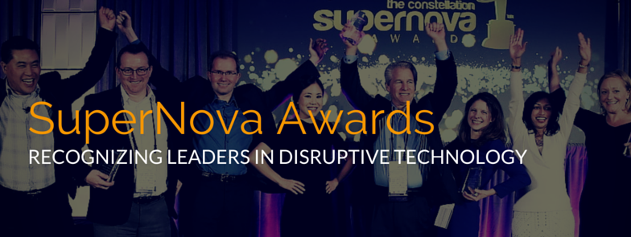

_The SuperNova Awards honor leaders that demonstrate excellence in the application and adoption of new and emerging technologies. _{.img-left}

In its sixth year, the Constellation_ **[SuperNova Awards](https://www.constellationr.com/events/supernova/2016)**_ will recognize nine individuals who demonstrate true leadership in digital business through their application of new and emerging technologies. We’re searching for leaders and teams who used disruptive technolgies to transform their organizations. Special recognition will be given to projects that seek to redefine how the enterprise uses technology on a large scale.

We’re searching for the boldest, most transformative technology projects out there. If you or someone you know has what it takes to compete in the SuperNova Awards, fill out _[the application](http://info.constellationr.com/download-supernova-award-application-checklist)_ here: 

[{.img-left}](http://cta-redirect.hubspot.com/cta/redirect/341263/9d75130d-7166-4805-ac3b-72177d3cc64f?__hstc=185180534.8632caa489f0666149ad9cba9a27f322.1454688719893.1455876225127.1457002447005.4&__hssc=185180534.1.1457002447005&__hsfp=3211536806)

## **_Timeline_**

  * February 8, 2016 application process begins. 
  * August 8, 2016 last day for submissions.
  * September 7, 2016 finalists announced and invited to Connected Enterprise.
  * September 12, 2016 voting opens to the public
  * September 21, 2016 polls close
  * October 27, 2016 Winners announced, SuperNova Awards Gala Dinner at _**[Connected Enterprise ](http://www.constellationevents.com/event/constellations-connected-enterprise-2016/)**_

## _Rewards_

  * [One ticket to Constellation's Connected Enterprise 2016](http://www.constellationevents.com/event/constellations-connected-enterprise-2016/)

  * Three month subscription to Constellation's research library

  * Three month membership in Constellation Executive Network, including three month access to Constellation Insights

## [_**Judges**_](https://www.constellationr.com/content/2016-supernova-award-judges)

Technology thought leaders, analysts, and journalists selected for their futurist mindset and ability to separate substance from hype. The SuperNova Award Judges carefully evaluate each SuperNova Award application against a rigorous set of criteria. Judges will identify individuals who demonstrate true leadership in the application and adoption of new and emerging technologies.  Want to catch a judge's eye? Judges look for projects whose elements can be replicated in other enterprises.

**[Learn more about the SuperNova Award Judges.](https://www.constellationr.com/content/2016-supernova-award-judges)**

## _**Categories**_

  *  **Internet of Things** - _**A network of smart objects enables smart services.**_ (examples: sensors, smart ‘things’, device to purchase)
  * ** [Data to Decisions](http://constellationr.com/content/data-decisions) - **_Using data to make informed business decisions. (examples: big data, predictive analytics) _****
  * ** [Digital Marketing Transformation](http://constellationr.com/content/digital-marketing-transformation) - _Personalized, data-driven digital marketing. _**
  * ** [Future of Work](http://constellationr.com/content/future-work): Social Business - _The technologies enabling teams to work together efficiently. (examples: enterprise social networks, collaboration)_**
  *  **[Future of Work](https://www.constellationr.com/content/future-work)**: **Human Capital Management** _**- Enabling your organization to utilize your workforce as an asset. (examples: talent management)**_
  * ** [Matrix Commerce](http://constellationr.com/content/matrix-commerce) - _Commerce responds to changing realities from the supply chain to the storefront. (examples: digital retail, supply chain, payments, omni-channel retail)_**
  * ** [Next Generation Customer Experience](http://constellationr.com/content/next-generation-customer-experience) - _Customers in the digital age demand seamless service throughout all lifecycle stages and across all channels. (examples: crm, customer experience)_**
  * ** [Safety and Privacy](https://www.constellationr.com/content/safety-and-privacy)_ - Strategies to secure sensitive data (examples: digital identity, information security, authentication)_**
  * ** [Technology Optimization & Innovation](http://constellationr.com/content/tech-optimization-and-innovation) - _Innovative methods to balance innovation and IT budgets. (examples: innovation in the cloud, ENSW cost savings, cloud ERP, efficient app production)_**
