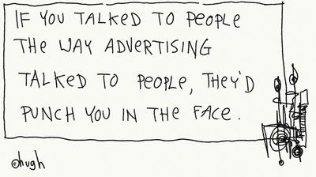

{.img-left}

When I read Hubspot’s  blog post about marketing clichés some rang more than a few bells – we try to avoid them but ‘best of breed’ sometimes slips through the net.   PRs have always had to translate marketing speak into everyday language.  We already run the risk of creating a ‘punch in the face’ moment if we call a journalist at a bad time, so adding to it by pitching them a cliché-ridden press release is a real no-no.

However, telesales and PRs are no longer the only ones who have to stand by what we pitch.  Social media marketing means an ad or piece of collateral no longer comes from an anonymous source - companies expect their staff to retweet/repost advertising, marketing and PR materials.  They are not going to be keen if it alienates the very people they are trying to influence.  This change in the way we communicate means that we need to change the language we use to communicate – it has to be authentic, it has to be something you could imagine saying. 

The cartoonist [Hugh MacCleod](http://gapingvoid.com/) helps with the process of creating authenticity for a number of companies, such as Rackspace, Intel, Cisco and Roche Pharmaceuticals – his role is business transformation through art.  His website has some great pieces that resonate – for PRs the obvious is, “Have a story. And make sure it’s a good one. A DAMN good one.” 

Because we have to pass the journalist test, we have to be able to objectively evaluate whether something is a good story that will resonate rather than irritate.  Are journalists going to use our press release for a game of buzzword bingo? Will they ridicule it publicly on [Twitter](https://twitter.com/ABridgwater/status/480698967802798080)? Are we sending something that is knowledgeable and insightful; or smug, brash and bragging?  Does it talk about why a story is important in relation to what’s happening in the world and what people care about?  Does it lead with what is new, different, or unique?  But ultimately the ‘punch in the face test’ may well cover all of those things! 

_(Image: via [gapingvoid](http://gapingvoid.com/2006/05/09/if-you-talked-to-people/))_
