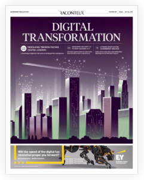

{.img-left} As you may know, The Times/Raconteur regularly publish a number of technology-focused supplements throughout the year. Last week was no different with the publication of its [‘Digital Transformation’](https://www.raconteur.net/digital-transformation-2017) supplement. With the topic of digital transformation being much discussed by technology companies for the last 18 months, there was understandably plenty of competition to get featured in the supplement. Therefore, we were excited to see that six different clients featured in the supplement – which was testament to the team’s proactivity and creativity in developing media-worthy content.

First up, the team secured an interview for Ross Mason, founder of [MuleSoft](http://www.mulesoft.com), to discuss the role of APIs in creating the [platform economy](https://www.raconteur.net/technology/launching-businesses-in-the-platform-economy).  A couple of our security clients ([IOActive](https://ioactive.com/) and [Huntsman Security](https://www.huntsmansecurity.com/)) and MuleSoft again, were then featured in a separate feature on [securing the digital world](https://www.raconteur.net/technology/design-security-in-and-keep-the-hackers-out), after the respective client teams had developed some great written comments.

The coverage didn’t stop there, as another feature on [the need for constant change](https://www.raconteur.net/technology/constant-digital-transformation-is-now-the-new-norm) saw the team secure x3 separate phone interviews for [Dynatrace,](https://www.dynatrace.com/) [Couchbase](https://www.couchbase.com/) and [HCL](https://www.hcltech.com/), all of whom were quoted extensively in the article, positioning all three companies as digital transformation thought leaders.

All in all, not bad for a day’s work 😊

If you would like to understand more about how we got our clients featured, then please [get in touch](http://www.sparkcomms.co.uk/contact-us/).
