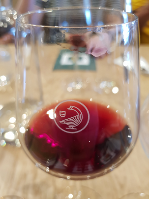
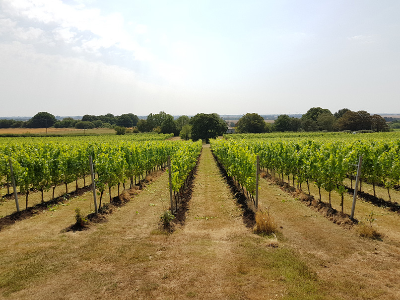

I’ll come clean – I’ve always been a little wary of team-building exercises. I like to think that, while our previous [summer days out](https://www.sparkcomms.co.uk/blog/spark-summer-day-out) have gently encouraged qualities that you’d like to see in a group, it’s never been the main intent. We’ve probably helped our collaboration and problem-solving in escape rooms; our teamwork in bubble football; or, while [sitting on a boat](https://www.sparkcomms.co.uk/blog/summer-day-laser-quest-electric-barge) playing board games, realised that the little envelope in the middle of the Cluedo board is supposed to have cards in it. But mainly these days have always been an opportunity to unwind, to celebrate achievements over the year, and to chat with people you might not always get the chance to – and for everyone to try something a little different (otherwise why not just go down the pub?).

With the globe baking in summer 2018, the climate suggested an outdoors activity, but one that wouldn’t involve strenuous activity and likely hospitalisations for heatstroke. After much deliberation, we settled on wine – specifically, visiting a vineyard, learning more about the creation and history of wine itself, and maybe even tasting and drinking some. Just a smidgen though

We settled on the [Gusbourne](https://www.gusbourne.com/) estate in Kent: which, from 2004 has been creating prize-winning English sparkling wines in the Kent countryside. Not only does it have an excellent reputation, it was also located a short train journey and taxi ride from St Pancras station – so perfectly positioned.

Strenuous activity and competition was very definitely not the order of the day. Instead, a short introduction to the history of the estate and the basics of wine making (coupled with sampling some of their wares), followed by a walk across the estate and a lesson on the agriculture of vine-growing and the local geography (coupled with a sampling of some of their wares), then a short tour of the actual manufacturing area of the winery and lunch (coupled with a sampling of.. oh, you get the idea) was a rather more accommodating schedule.

There was certainly a lot to learn on the day – both at the estate itself, then on the train back to London and the confines of [The Thornhill Arms](https://www.thethornhillarms.com/) at Kings Cross. Even the heavens opening for the first time in what felt like 969 years, rendering booking a beer garden spot a little moot for a while, couldn’t dent the atmosphere. And everyone still got home in time for a kebab, which after all is what Friday night is really about.

Maybe we’ll see some of you in 12 months time at the next summer day out. In the meantime, at the rate places get booked up it’s probably time to start planning the Christmas party…