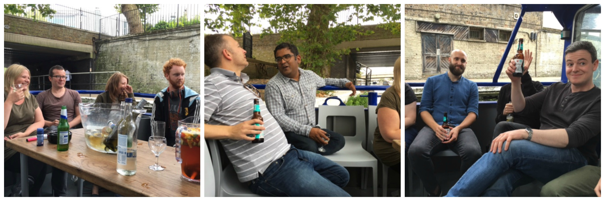

As the autumn leaves start falling, I thought it would be a good time to reflect on the Spark highlight of the summer - our annual day out.

The day started with a trip to [Star Command Laser Tag](http://www.ultimaterecreation.co.uk/starcommand/laser-tag-london.asp) in Whitechapel - as the name suggests a spaceship-themed game with laser guns. I would like to report some great skills on my part, but sadly I had the worst score both in terms of being hit and not hitting others enough – won’t give up the day job thenJ. It was a fun experience if a little hot given there seemed to be a lack of aircon and a lot of very competitive PRs running around.

Following our shooting exploits we headed to Paddington to board the [Electric Barge](http://theelectricbarge.co.uk/) a river journey which took us from Little Venice, along Regent’s Canal and past London Zoo and Camden Lock. On board we played Hungry Lyons and Gusdo - Spark takes on the popular games of Hungry Hippos and Cluedo. We also had a nice selection of food and drinks to an eclectic mix of music as we travelled along the canal. We ended up back in Little Venice at [the Waterway](http://www.thewaterway.co.uk/) restaurant where we continued to drink the night away and eat some good grub – we didn’t let a little British summer rain ruin what was a great day out.

The day was perfect to let off some steam after a very busy and successful first half of the year. It was also a rather fun introduction to Mike Marquiss who joined us shortly after this day – thankfully we didn’t put him off :). As we continue to grow events like these will be even more important for everyone getting to know each other and the company culture.

Spark socials are voted for by everyone, in previous years we have done [axe throwing](http://www.claypigeonshootingbrighton.co.uk/axe-throwing.html) in Brighton and [Bubble Football](http://londonbubblefootball.co.uk/) in East London – any ideas for wacky days out for next year would be greatly appreciated!
