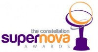

{.img-left}Many of you probably know Ray Wang, esteemed industry analyst, from his days at Forrester or more recently his own firm Constellation Research. Ray asked me to be a judge for the inaugural Constellation SuperNova Awards the other week, and without hesitation I said yes. The challenge now is I need to show I know something about my chosen category, mobile enterprise!

In all seriousness though, mobility to me is one of the most dynamic and interesting areas of the technology landscape today. Whether it is mobile technology revolutionising business processes or new enterprises being created through the opportunities that mobility creates, this is an area that is starting to touch every part of our lives.

Most award programmes recognise technology suppliers for their advancements in the market.  These awards however are focused on the individual who has created change and disruption within their organisation by putting new technologies to work.

There are five categories in all, covering cloud computing, mobile enterprise, social business, advanced analytics and emerging technologies. If you know anyone that has done some great work in this area get them to enter. If you are vendor or services company why not nominate your customers.

More details can be found at [http://www.constellationrg.com/events/supernova/](http://www.constellationrg.com/events/supernova/)
