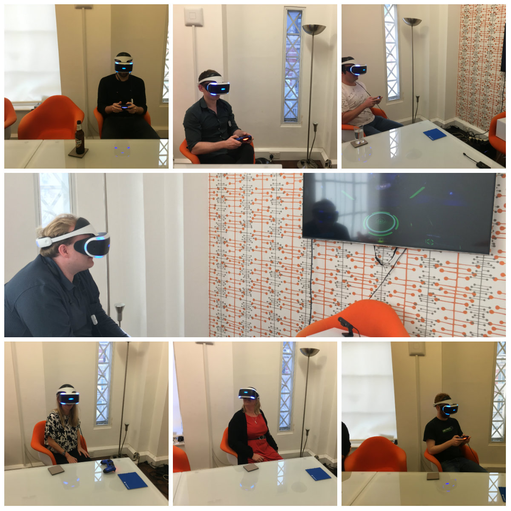

As VR is steadily becoming sharper, affordable and comfortable, every industry is clamouring to find a reason to stock a headset in their offices (apparently wanting to play Resident Evil on lunch isn’t a good enough reason…). VR is being used to bring [comic books](https://www.engadget.com/2017/10/12/square-enix-project-hikari-vr-comics/) to life, launch virtual showrooms in the [motor industry](https://www.roadtovr.com/audi-virtual-reality-car-showroom-htc-vive-pre-oculus-rift-cv1/), and even train [medical professionals](https://venturebeat.com/2017/07/22/how-vr-training-prepares-surgeons-to-save-infants-lives/) on decision-making in demanding situations. While we spend a lot of time with our clients discussing how they might be using VR tech, it’s time to be selfish and ask – ‘what about us?’

A Friday afternoon brainstorm was the only thing for it, so we brought in a Playstation VR headset to the office to carry out some very important research. In the resulting chaos, Spark team members went scuba diving, drove tanks, and flew space ships, using a 1920x1080 resolution screen strapped an inch in front of their face. There were plenty of ‘oohs’ and ‘aahs’, but eventually everyone managed to shut me up and started to enjoy using the headset themselves.

It wasn’t all fun and games, and between the Spark team we came up with a number of ways the tech could be used by PRs to add another element to client stories, grab the interest of journalists, or just save ourselves the pain of a trip with Southern Rail:

**Virtual press tours:** VR could be used to demonstrate products or offer virtual tours to journalists and analysts, demonstrating products or locations that are usually difficult to access for security, logistical, or financial reasons. For example, we could offer a virtual look around ViaSat’s new satellite while it’s in orbit, or a tour of a data centre in the Arctic from the comfort of your own office. As journalists are more pushed for time than ever, it’s a brilliant way to show something up-close, without attendees having to spend time travelling.

**Keynotes in VR:** Have a client speaking at an event, but the press aren’t attending? Put journalists in the front row with VR and save them the hassle of event queues, overpriced coffee, and being swarmed by those damned pesky PRs!

**Venue scouting:** Often, when looking for a place to host a roundtable, interview series or launch event, getting a feel for the venue is vital before making the booking. Doing the rounds and visiting conference centres, private dining areas, and meeting rooms, can take days – but by using a VR headset, you could easily get an idea of whether the space fits your needs or not.

**VR conferencing:** Finding it hard to pin everybody down for a meeting? PR teams could create a virtual conference space for webinars, conference calls, and meetings. This could offer a visual medium for presenters to get their message across to journalists, colleagues or remote workers, while saving on hours of back and forth in an Outlook calendar.

**Virtual media training:** Being interviewed for the first time by the media can be unnerving, even for top execs. By using VR to host mock interviews, perhaps in the Sky News studio for example, spokespeople can have an opportunity to practice getting their message across in a similar environment, before taking on the real thing.

Now the tech’s here, it’s time for PRs to jump on the bandwagon and find new ways to engage with the media – if not, we might as well go back to faxing releases! Can you think of a better use case for PRs using VR? If so, feel free to get in touch and let us know what we’ve missed.

