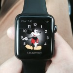

I decided to buy an Apple Watch about a month ago and have had various people ask me what it is like and whether it is worth buying.

It is worth mentioning at this point that I am a bit of an early adopter, so I didn’t have a killer feature in mind, I just wanted the watch for no particular reason than that it seemed like a cool gadget to have :) Anyway here are my experiences thus far:

**Device as a Watch**

Any review of the Watch I guess needs to cover off any features as a watch and then also as a wearable gadget. As a watch, it is certainly cool with lots of different faces to choose from, from the simple to the chronograph and my personal favourite the Mickey Mouse one. The different types of faces can all be customised and can display the time for other countries, the current temperature, double as a stopwatch and provide information on the moon and the wider solar system. So it’s a standard watch and more.

I went for the [basic Watch](http://www.apple.com/uk/shop/buy-watch/apple-watch) with a plastic strap then supplemented it with cheaper Hong Kong alternatives. These would have set me back over £600 through Apple and personally I don’t think it would have been worth it.

I also don’t see the logic in buying the [Watch Edition](http://www.apple.com/uk/shop/buy-watch/apple-watch-edition). Assuming I had that sort of money to spend, I would buy a Rolex, not a gadget with electronics that will most likely degrade over time and will have been superceded by a significantly better model.

To sum up as a watch it is a decent one, and I like the fact I can interchange the faces in a way you can’t as easily do with a standard watch. But I wouldn’t want to pay more than the £400 or so that I did.

**Device as a Wearable Gadget**

When the Watch really comes into its own is as a wearable gadget and the features to be had here. It is worth noting that pretty much all the features do need the iPhone so you can’t have one without the other. In fact if the iPhone has run out of battery or is out of range the Watch really only acts purely as a watch, though it does still seem to track activity.

On to what it can do. You can both answer calls, make calls and answer texts on your Watch which feels James Bondesque J. You can also view photos on the Watch, though as the screen is small this is really only helpful as a preview. If like me you are always misplacing your phone, it has a nifty feature that allows you to ‘ping’ your iPhone to hear where it is. It also acts as a remote for your music, takes your heart rate (useful for health purposes and the hypochondriac in us all) and even gives you up to date stock information (for those inclined). Other features are dependent on the apps you have, as with the iPhone; for instance I have the BBC app and helpfully the Watch buzzes with breaking news.

As a fitness gadget it is brilliant – I can track my calories, hours standing and Apple minutes earnt (something that is no easy feat versus others). I can also see basic information like how many steps I have done, and distance covered just as my Nike Fuelband used to do for me. It also encourages you, as with all fitness bands, to do more, physically ‘nudging’ you to stand up more, etc.

My favourite feature of the watch though has to be the integration with maps. I was one of the first people to complain when Apple replaced Google Maps with its own version but I have to say it comes into its own on the Watch. No longer do I have to keep looking at my phone to see where to go next, the Watch gives me short instructions such as turn left in 100 yards and even nudges me to turn when I get to it. This makes it so much more intuitive to follow directions and get somewhere without constantly looking down. As someone that loves walking across London, this is a huge plus for me.

To recap the Watch is a decent one and its features as a wearable gadget do take it into a league of its own -  I am very happy with my purchase and won’t be parting with my wearable anytime soon :)
