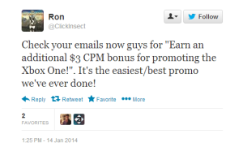

Last month, [it was leaked](http://www.theinquirer.net/inquirer/news/2324257/microsoft-reportedly-pays-youtube-uploaders-to-promote-xbox-one) that Microsoft is embarking on an influencer programme, whereby YouTubers  affiliated with the prolific YouTube gaming network [Machinima](https://www.machinima.com/), would be paid an extra $3 per 1000 views (on top of what they make from their ad revenues) to positively promote the Xbox One. Any videos made as a part of the programme were instructed to use the tag ‘XB1M13’.

Details of the leak were quickly spread around the Internet and outrage quickly ensued. The thing is that ‘influencer programmes’ aren’t anything that out of the ordinary – prolific YouTubers are regularly paid by video game companies to endorse their products: nothing different from typical sponsorship deals in sports, for example. But what made this different is that a line was crossed.

The leaked information revealed an NDA clause, which states that anyone who participates in the influencer programme was not allowed to disclose any details of the programme, and were not allowed to say anything negative about the Xbox One. In other words, they were instructed to hide the fact that they were part of the deal. Details of the sponsorship would have to be hidden.

For some reason, the UK’s Community Manager for Machinima tweeted about this deal, before quickly taking his tweet down.

{.img-left}

 Aside from the fact that this kind of practice is illegal in the US under the [FTC law](http://www.socialmediaexplorer.com/social-media-marketing/disclosures-for-bloggers-and-brands/) (which states that endorsements require disclosure), this has serious moral and ethical implications. As a comparison, PR is inherently about earning your coverage on the merit of the story itself. We know that offering money to a journalist to cover a story is, well, wrong.

But should we hold YouTube channels to the same standards that we hold our journalists to? I think that YouTube is an evolving medium and still somewhat in its infancy: yes, it’s inundated with cat videos and fail compilations, but if you look at the top subscribed channels on YouTube, and filter out the music channels, what you’re left with is predominantly gaming channels.  Video game coverage, from reviews to ‘Let’s Play’ content like [PewDiePie’s channel](http://www.youtube.com/user/PewDiePie?gl=GB&hl=en-GB), can receive millions of views per video. Gaming channels make up a lot of the most watched content online.

A lot of this has to do with the way that consumers buy games these days – they like to see footage of the game they are going to play before the actually buy it. It also helps that the host is entertaining, but the point here is that people are looking to these YouTubers for their opinion; their thoughts, from which they can decide whether or not to give away their money. Not too dissimilar from how we see journalism?

(As an aside, it’s not just gaming that this applies to – I watched countless reviews of tablets on YouTube before buying an iPad Air.)

So for Microsoft to pay for positive coverage of the Xbox One, definitely crosses a line. I think that YouTubers should certainly be considered ‘influencers’. Although YouTube is not necessarily used to the same extent in technology journalism and technology PR at the moment, I feel that it does need to be free from money’s influence and should be a platform for unbiased opinion. Sponsorship needs to be made explicit, especially when opinions are being shared.
